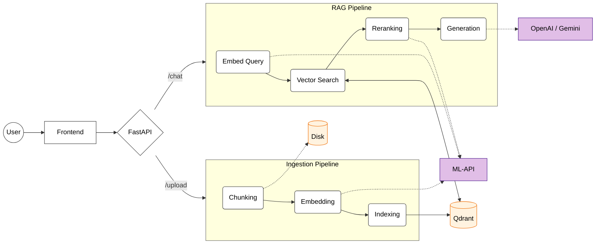

# Architecture

The application implements a modular, containerized Retrieval-Augmented Generation (RAG) system. It is designed to be scalable, maintainable, and efficient, leveraging modern tools like `uv` for Python dependency management and Docker for orchestration.

## High-Level Overview

The system follows a microservices pattern, consisting of four main components:

1.  **Frontend (React/Vite)**: The user interface for uploading documents and chatting. Managed with `pnpm`.
2.  **Backend (FastAPI)**: The main orchestration layer. It handles file uploads, manages the RAG pipeline, and communicates with the ML and Database services.
3.  **ML-API (FastAPI/PyTorch/ONNX)**: A specialized service for compute-intensive tasks (Embedding and Reranking). It is designed to run on GPU (CUDA) but falls back to CPU if needed.
4.  **Vector Database (Qdrant)**: Stores and indexes document embeddings for fast semantic retrieval.

## Data Flow

### 1. Document Ingestion
1.  **Upload**: User uploads a file (PDF/Text) via the Frontend.
2.  **Processing**: Backend receives the file, saves it to `uploads/`, and splits it into semantic chunks.
3.  **Embedding**: Backend sends text chunks to ML-API (`/embed`). ML-API uses the `bge-m3` model to generate dense vectors.
4.  **Indexing**: Backend stores the vectors and payload (text content) in Qdrant.

### 2. RAG Query
1.  **Query**: User sends a question.
2.  **Retrieval**:
    -   Backend sends the question to ML-API (`/embed`) to get a query vector.
    -   Backend searches Qdrant for the top K most similar document chunks.
3.  **Reranking**:
    -   Backend sends the query and retrieved documents to ML-API (`/rerank`).
    -   ML-API uses `bge-reranker-base` to score and re-order the documents based on relevance.
4.  **Generation**:
    -   Backend constructs a prompt with the user's question and the top reranked context.
    -   The prompt is sent to an external LLM (e.g., OpenAI, Gemini).
5.  **Response**: The LLM's answer is streamed back to the user.

## System Diagram

## Design Decisions

### Dependency Management (uv)
We use **uv** for Python dependency management across both Backend and ML-API services.
-   **Speed**: `uv` is significantly faster than pip/poetry.
-   **Determinism**: `uv.lock` ensures reproducible builds.
-   **Workspace Support**: While currently treated as separate projects, `uv` allows for easy workspace management if we decide to merge them.
-   **Torch Handling**: `uv` (specifically in `ml-api`) handles the complexity of CUDA-specific PyTorch wheels gracefully using source markers.

### ML-API Separation
Machine learning models (Embeddings, Reranker) are heavy and require significant memory/GPU resources. Separating them into `ml-api` allows:
-   **Independent Scaling**: We can scale the lightweight Backend separately from the heavy ML-API.
-   **Resource Isolation**: ML-API can be pinned to GPU nodes, while Backend runs on cheap CPU nodes.
-   **Simplified Dependencies**: Backend doesn't need PyTorch or CUDA libraries, keeping its image small.

## Production Considerations
-   **Scaling**: Qdrant can be deployed in cluster mode for high availability. ML-API can be horizontally scaled behind a load balancer.
-   **Security**: Ensure API keys are injected via secure environment variables. Implement authentication for the Backend API.
-   **Caching**: Embedding results could be cached to reduce load on ML-API for repeated documents.
